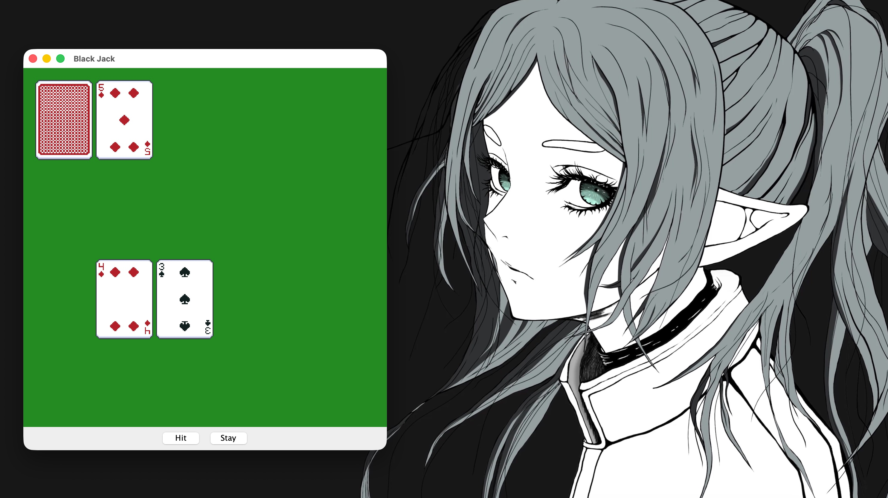

# 🃏 Black Jack



Классический Black Jack, написанный на **Java Swing**. Реальные карточные спрайты, скрытая карта дилера и честная логика туза — всё в одном файле.

---

## ✨ Возможности

- 🎮 **Классический геймплей** — Hit или Stay, пока не наберёшь 21 или не перебьёшь
- 🃏 **Настоящие карточные спрайты** — 52 изображения карт из единого спрайтшита
- 🙈 **Скрытая карта дилера** — рубашка раскрывается только после Stay
- 🤖 **Автоматический дилер** — добирает карты до суммы ≥ 17
- 🂠 **Умная логика туза** — A считается как 11, автоматически снижается до 1 при перебое
- 🔀 **Перемешивание колоды** — каждая партия начинается со случайного порядка карт
- 🏆 **Результат на экране** — You Win / You Lose / Tie выводится прямо на игровое поле

---

## 📁 Структура проекта

```
BlackJack/
├── src/
│   ├── App.java         # Точка входа (main), создаёт экземпляр BlackJack
│   └── BlackJack.java   # Вся логика: колода, раздача, ходы, отрисовка
├── resources/
│   └── images/
│       ├── 01_kerenel_Cards.png  # Туз червей
│       ├── 02_kerenel_Cards.png  # Двойка червей
│       ├── ...
│       └── 28_kerenel_Cards.png  # Рубашка (скрытая карта)
└── README.md            # ← вы здесь
```

---

## 🧩 Как это работает

### Карта

Каждая карта — экземпляр внутреннего класса `Card`:

```
value = "A" | "2"–"10" | "J" | "Q" | "K"
type  = "H" (hearts) | "S" (spades) | "D" (diamonds) | "C" (clubs)
```

Числовое значение вычисляется автоматически:

```
J, Q, K → 10
A       → 11 (снижается до 1 при перебое)
2–10    → номинал
```

### Архитектура

Всё состояние хранится прямо в классе `BlackJack`:

```java
ArrayList<Card> deck;        // колода
Card hiddenCard;             // скрытая карта дилера
ArrayList<Card> dealerHand;  // рука дилера
ArrayList<Card> playerHand;  // рука игрока
int dealerSum, playerSum;    // текущие суммы
int dealerAceCount, playerAceCount; // количество тузов
```

### Игровой цикл

Вместо таймера — событийная модель на основе кнопок:

```java
hitButton  → добавить карту игроку → repaint()
stayButton → дилер добирает до 17+ → repaint() → показать результат
```

### Спрайты карт

Индекс файла вычисляется из масти и достоинства:

```
H (hearts):   fileIndex = rankIndex + 1
S (spades):   fileIndex = 15 + rankIndex
D (diamonds): fileIndex = 29 + rankIndex
C (clubs):    fileIndex = 43 + rankIndex
```

### Логика туза

Когда сумма превышает 21, туз «схлопывается» с 11 до 1:

```java
while (sum > 21 && aces > 0) {
    sum -= 10;
    aces--;
}
```

---

## 🎮 Управление

| Кнопка | Действие |
|--------|----------|
| `Hit`  | Взять ещё одну карту |
| `Stay` | Передать ход дилеру и подвести итог |

---

## 🔧 Запуск

```bash
# Компиляция
javac -d bin src/App.java src/BlackJack.java

# Запуск (из корня проекта)
java -cp bin App
```

> **Важно:** директория `resources/images/` должна находиться в корне проекта рядом с `bin/`. Иначе карты не загрузятся и поле останется пустым.

---

## 🛠️ Технологии

- **Java** — основной язык
- **Swing (javax.swing)** — окно, панель, кнопки
- **AWT (java.awt)** — отрисовка, события, изображения
- **ImageIO (javax.imageio)** — загрузка PNG-спрайтов карт

---

## 🎨 Цветовая схема

| Элемент        | Цвет          | Hex       |
|----------------|---------------|-----------|
| Игровое поле   | Зелёный       | `#228B22` |
| Текст результата | Белый       | `#FFFFFF` |
| Фон кнопок     | Системный     | —         |

---

## 📄 Лицензия

Проект с открытым исходным кодом, распространяется под лицензией [MIT](LICENSE).